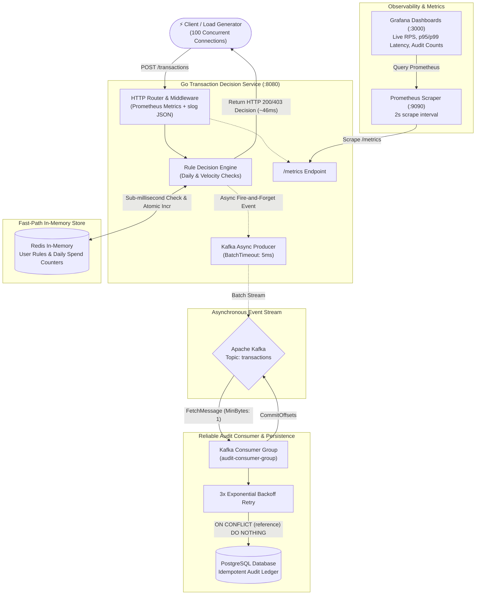

# Distributed Transaction Decision Service

[](https://golang.org)
[](https://redis.io)
[](https://www.postgresql.org)
[](https://kafka.apache.org)
[](https://prometheus.io)
[](https://grafana.com)

A high-performance, fault-tolerant **Distributed Transaction Decision Service** in Go that validates and evaluates financial transactions under strict latency budgets. 

By decoupling the **sub-millisecond fast-path decision engine** (Redis) from the **slow-path persistent audit pipeline** (PostgreSQL via Apache Kafka), the service eliminates synchronous database write contention and achieves a **10x throughput increase** and **16x reduction in p99 tail latency**.

---

## 🏛 System Architecture



---

## 🚀 Key Engineering Highlights & Patterns

### 1. Fast-Path / Slow-Path Separation
* **Fast-Path Decision (Redis):** Evaluates transaction limits and daily spending quotas atomically in Redis using cache-aside patterns (`INCRBYFLOAT`, daily TTL keys). The HTTP client receives an immediate decision (APPROVED / DECLINED) without waiting for durable disk writes.
* **Slow-Path Audit (Kafka $\to$ PostgreSQL):** Approved and declined transaction events are pushed asynchronously to Kafka. An audit consumer group processes records and persists them to PostgreSQL in the background.

### 2. Kafka Reliability & Idempotency
* **Consumer Groups & Offset Management:** Uses explicit manual offset committing (`FetchMessage` $\to$ process $\to$ `CommitMessages`) to guarantee at-least-once delivery semantics.
* **Idempotent DB Ingestion:** Every transaction is tagged with a unique idempotent reference key (`txn_<user_id>_<timestamp>`). PostgreSQL inserts utilize:
  ```sql
  INSERT INTO transactions (reference, user_id, name, amount, status)
  VALUES ($1, $2, $3, $4, $5)
  ON CONFLICT (reference) DO NOTHING
  ```
  Guarantees zero duplicate records even during consumer restarts, partition rebalances, or network retries.
* **Resilient Retry Loop:** Transient PostgreSQL connection drops trigger a 3-attempt exponential backoff before message offsets are blocked or routed to dead-letter storage.

### 3. Latency & Batching Optimizations
* **Writer Batch Timeout Tuning:** `segmentio/kafka-go` defaults to a `1000ms` `BatchTimeout`, causing individual HTTP requests to wait up to a full second. Tuned to `5ms`, achieving single-digit request latencies while preserving throughput batching under concurrent load.
* **Consumer Starvation Fix:** Tuned consumer `MinBytes: 1` (down from `10KB`) to eliminate pipeline stalls under low-traffic intervals.

### 4. Production Observability & Resilience
* **Prometheus Instrumentation:** Custom collectors for:
  - `http_request_duration_seconds` (histogram with p50, p95, p99 quantiles)
  - `transaction_decisions_total{status="approved|declined"}`
  - `kafka_audit_saved_total`
* **Structured Logging:** Standardized JSON logs using Go 1.21+ `log/slog` for distributed tracing and machine readability.
* **Graceful Shutdown:** Traps `SIGINT`/`SIGTERM` with an `os.Signal` notification context to finish inflight requests and safely drain the Kafka consumer before process termination.

---

## 📊 Empirical Load Test & Benchmark Results

Benchmarked with **Autocannon** (100 concurrent persistent connections over HTTP/1.1):

| Metric | Synchronous PostgreSQL (Before) | Decoupled Kafka Pipeline (After) | Improvement |
| :--- | :---: | :---: | :---: |
| **Throughput (Req/Sec)** | **222 req/s** | **1,000 – 2,111 req/s** | **~5x – 10x Boost** 🚀 |
| **Average Latency** | **424.0 ms** | **46.8 – 101.8 ms** | **~4x – 9x Faster** ⚡ |
| **p95 Latency** | **1,850 ms** | **237 ms** | **7.8x Reduction** |
| **p99 Tail Latency** | **2,073 ms** | **127 – 273 ms** | **Up to 16x Lower Tail Latency** |
| **Data Integrity** | Prone to connection pool exhaustion | **100% Audit Ingestion** (Zero Dropped Writes) | Fault-Tolerant |

---

## 🛠 Tech Stack

* **Language:** Go 1.22+ (`net/http`, `log/slog`, `database/sql`, `sync`)
* **Fast-Path Cache:** Redis 7 (`redis/go-redis/v9`)
* **Event Broker:** Apache Kafka 7.4.0 (`segmentio/kafka-go`)
* **Audit Database:** PostgreSQL 16 (`jmoiron/sqlx`, `lib/pq`)
* **Telemetry & Metrics:** Prometheus Go Client (`prometheus/client_golang`)
* **Visualization:** Grafana (Dashboards provisioning & live tail latency graphs)
* **Load Testing:** Autocannon / k6

---

## 🏃 Getting Started

### Prerequisites
* Go 1.22+ installed
* Docker & Docker Compose installed and running
* PostgreSQL running locally on port `5432`

### 1. Database Setup
Create the PostgreSQL database and tables:
```sql
CREATE DATABASE transactions;

CREATE TABLE IF NOT EXISTS user_rules (
    user_id INT PRIMARY KEY,
    daily_limit NUMERIC NOT NULL,
    transaction_limit NUMERIC NOT NULL
);

CREATE TABLE IF NOT EXISTS transactions (
    id SERIAL PRIMARY KEY,
    reference VARCHAR(100) UNIQUE NOT NULL,
    user_id INT NOT NULL,
    name VARCHAR(255) NOT NULL,
    amount INT NOT NULL,
    status BOOLEAN NOT NULL,
    created_at TIMESTAMP DEFAULT CURRENT_TIMESTAMP
);

-- Seed test user rules
INSERT INTO user_rules (user_id, daily_limit, transaction_limit) 
VALUES (1, 100000, 5000) 
ON CONFLICT (user_id) DO NOTHING;
```

### 2. Start Supporting Infrastructure (Docker)
```bash
# Redis
docker run -d --name redis -p 6379:6379 redis:alpine

# Kafka Network & Broker
docker network create kafka-net
docker run -d --name kafka --network kafka-net -p 9092:9092 \
  -e KAFKA_ENABLE_KRAFT=yes \
  -e KAFKA_CFG_PROCESS_ROLES=broker,controller \
  -e KAFKA_CFG_CONTROLLER_LISTENER_NAMES=CONTROLLER \
  -e KAFKA_CFG_LISTENERS=PLAINTEXT://:9092,CONTROLLER://:9093,DOCKER://:29092 \
  -e KAFKA_CFG_LISTENER_SECURITY_PROTOCOL_MAP=CONTROLLER:PLAINTEXT,PLAINTEXT:PLAINTEXT,DOCKER:PLAINTEXT \
  -e KAFKA_CFG_ADVERTISED_LISTENERS=PLAINTEXT://localhost:9092,DOCKER://kafka:29092 \
  -e KAFKA_BROKER_ID=1 \
  -e KAFKA_CFG_CONTROLLER_QUORUM_VOTERS=1@127.0.0.1:9093 \
  -e ALLOW_PLAINTEXT_LISTENER=yes \
  bitnami/kafka:3.4.0

# Prometheus
docker run -d --name prometheus -p 9090:9090 \
  -v $(pwd)/prometheus.yml:/etc/prometheus/prometheus.yml \
  prom/prometheus:latest

# Grafana
docker run -d --name grafana -p 3000:3000 grafana/grafana:latest
```

### 3. Run the Go Service
```bash
go run .
```
The service will start on `http://localhost:8080`.

### 4. Run Load Test
```bash
npm install
node loadtest.js
```

---

## 📈 Monitoring & Dashboards

* **Prometheus Metrics:** `http://localhost:9090` (Scraping `http://host.docker.internal:8080/metrics`)
* **Grafana Dashboard:** `http://localhost:3000` (Default login: `admin`/`admin`)
  - **Panels:**
    - *Request Throughput (Req/Sec)*: `rate(transaction_decisions_total[10s])`
    - *p95 & p99 Tail Latency*: `histogram_quantile(0.99, ...)` & `histogram_quantile(0.95, ...)`
    - *Total Transaction Decisions Counter*
    - *Kafka Audit Records Committed to PostgreSQL Counter*

---

## 📜 License
Distributed under the MIT License.
